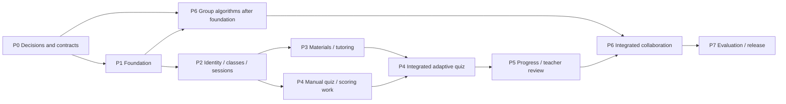

# InSync implementation plan

**Version 0.3 — issue #2 decisions and runtime/backlog amendment approved on 10 October 2026, Asia/Karachi. Original v0.2 approved on 9 October 2026.**

This plan prepares the existing InSync design for implementation by three contributors. It contains eight phases and 61 issues. Application implementation has not started. All 61 GitHub issues, eight phase milestones, and phase/type/workstream/status labels are now published and verified. Real-person assignments remain open; no separate project board was created.

**Revision 0.2:** the human clarified that the shared workspace uses Yjs. The plan now names Yjs explicitly, adds an early compatibility/control proof (P1-10), and expands the workspace implementation and verification issues. This clarification selects the synchronization technology; remaining controlled-editing semantics in Q11 still require their specific decisions.

The recorded approval covers the phase structure, scope breakdown, collaboration method, and creation of this backlog in `Haadiyah-Zafar/InSyncc`. It does **not** silently approve unresolved product, algorithm, schema, provider, or access decisions. Phase 0 turns those decisions into reviewable records before their dependent implementation starts.

Read the [detailed issue backlog](ISSUE_BACKLOG.md) for each issue's scope, dependencies, approval boundary, and acceptance checks. [GITHUB_ISSUES.json](GITHUB_ISSUES.json) contains the same drafts in a structured form for publication after approval. IDs such as `P4-04` are planning IDs, not GitHub issue numbers.

## 1. Starting point and evidence

The inspected `main` checkout at `b912bda2f016e07c4f6a5b5f5620150a99c25e98` contains three Markdown handoff documents, the 135-page report, a ZIP containing identical copies of the handoff documents, and a ChatGPT login screenshot. There is no frontend/backend application, dependency manifest, migration, or test suite yet. The login screenshot is not evidence of an implemented InSync screen.

Primary planning sources:

- [INSYNC_CODEX_CONTEXT.md](../INSYNC_CODEX_CONTEXT.md): scope, selected stack, agent responsibilities, numerical rules, and lifecycle.
- [INSYNC_REVIEW_REQUIRED.md](../INSYNC_REVIEW_REQUIRED.md): Q01–Q18 and the missing-conversation coverage limit.
- [INSYNC_SCHEMA_INVENTORY.md](../INSYNC_SCHEMA_INVENTORY.md): 21 candidate entities and known gaps; not an approved migration specification.
- [F26-148.pdf](../F26-148.pdf): methodology and architecture, especially Chapters 5–6. Its implementation language does not establish that code exists. This planning pass cross-checked the relevant report text; it does not claim every diagram or historical conversation was independently reviewed.

The handoff's confirmed decisions take precedence over conflicting report examples. Unresolved questions retain their status until the human approves a specific resolution and its affected dependencies.

## 2. Target and scope

**Confirmed scope clarification, 9 October 2026:** Programming Fundamentals includes broader foundational CS content, including data structures and database concepts. The first demo includes a shared Python editor with execution and displayed output, plus a shared whiteboard, with a separate editing-control holder for each surface. [Issue #2’s decision package](decisions/P0-01-pilot-scope.md), D1–D5 and §9.1, was approved on 10 October 2026: twelve syllabus areas, screen inventory, evaluation baseline, limited report corrections, and Python-runtime issue #64 with affected backlog updates. Runner technology/limits, board tools, and handover policies remain with their owning decisions. See [decision status](decisions/README.md).

**Provider decision, 9 October 2026:** OpenRouter is selected as the initial text-generation gateway. Exact model IDs and underlying provider routes, 10–15-model qualification, quotas/budgets, and embedding model/hosting remain pending. A second runtime gateway is not required by this decision.

The target is a Programming Fundamentals web pilot for school and university audiences, in English, on modern laptop/desktop browsers. Preserve all five agents: Tutor Agent, Quiz Agent, Progress Agent, Teacher Assistant Agent, and Discussion Agent. Preserve all four logical subsystems within the selected architecture.

The selected stack is React/TypeScript with Yjs for the shared document; one Python/FastAPI backend containing application services and LangGraph agent modules; SQLAlchemy/Pydantic; Supabase PostgreSQL with pgvector; Supabase Authentication; FastAPI WebSockets; and Redis for temporary real-time state. Exact tool versions, editor binding, compatible Yjs transport adapter, LLM/embedding models, storage configuration, background execution, and hosting will be approved and pinned during the relevant decision/foundation issues.

The complete pilot journey is:

1. Teacher creates a class, establishes topics/concepts, enrolls students, and uploads Learning Material.
2. Teacher starts a learning session; students use material-grounded adaptive tutoring.
3. Ending the session creates a draft quiz. Teacher review precedes assignment and student access.
4. Students take adaptive quizzes; newly generated in-attempt questions require additional teacher approval.
5. Progress Agent analyzes accumulated evidence. Teacher Assistant Agent proposes evidence-based recommendations.
6. Teacher approves or dismisses recommendations. Only approved actions execute and produce later evidence.
7. Teacher requests balanced or strength-based groups, or creates manual groups; approval/editing precedes student access.
8. Approved groups discuss and use a Yjs-synchronized Python editor with Run/output and a shared whiteboard, each with its own editing-control holder and the agreed handover policy. Discussion Agent provides validated hints, with evidence feeding later analysis under approved attribution rules.
9. The team evaluates quality/usability/performance/cost, verifies recovery and access, and presents the pilot for acceptance.

Phase 5 is an intermediate demonstration of the individual learning cycle. Phase 6 completes the collaboration scope; it is not optional merely because it appears later. Phase 7 makes the full pilot evaluable and operable.

Mobile applications, unrelated non-CS subjects, external student-information-system integration, emotion/sensor monitoring, model fine-tuning, and additional agent frameworks are outside the recovered current scope. Prototype-only controls follow the approved required/deferred/illustrative inventory in issue #2. Weekly emails, quiz hints, calendars, and global search are deferred; required data controls still follow #8.

### Required 10–15-model fallback chain for testing and demos

**User-approved amendment, 9 October 2026.** The pilot must have an explicit, ranked chain of **10–15 distinct text-generation models total: one primary and 9–14 alternatives**. This replaces the earlier provider-wrapper-only treatment of failover. The precise model IDs, licenses, provider routes, underlying OpenRouter provider routing, and numerical budgets remain decisions in [GitHub #8](https://github.com/Haadiyah-Zafar/InSyncc/issues/8); OpenRouter has subsequently been selected as the initial gateway, but the model candidates have not yet been selected or tested.

- Each candidate needs verified account access and dated live tests for its eligible agent operations, structured-output/content requirements, context limits, latency, cost, and usable quota where observable. Duplicate aliases/routes do not inflate the model count.
- The selection must identify shared limits at model, underlying-provider, account, and platform level. Ten models behind the same exhausted account may all be unavailable; candidate count is not an availability guarantee.
- The implementation honors approved transient-failure handling, Retry-After/cooldowns, route health, total request deadline, maximum attempts, and aggregate cost/retry/regeneration budgets. It must not blindly attempt all 15 models at 20 seconds plus two retries each. Exact budget values are approved in #8.
- Each operation uses its quality/capability-eligible subset. All candidates retain output validation, educational constraints, and teacher-review gates. Retries and switches preserve logical request identity and prevent duplicate side effects.
- All-routes-unavailable behavior is explicit, bounded, and preserves saved work. No silent fabricated/canned success is used to conceal an outage.
- Embeddings are a separate dependency: preserve the approved model/version and embedding space. Equal vector dimensions alone do not permit swapping embedding models; changes require the approved re-embedding/index migration.
- Before a demo, verify candidate availability and representative calls, and exercise simulated primary/multiple-route failure and complete exhaustion. Fault injection must not deliberately consume real service quotas.

This requirement is tracked in six existing issues: **#8** selection and budgets; **#18** registry/runtime failover; **#55** operational visibility/pre-demo checks; **#56** failure/recovery tests; **#57** per-model educational evaluation; **#61** final demo acceptance. The backlog now contains 61 issues and eight milestones, including the separately approved runtime issue. The initial fallback tests belong in #18; they are not postponed until the release phase. A proposed demonstration earlier than Phase 7 must run the same relevant pre-demo checks.

## 3. Phases and acceptance gates

| Phase | Purpose and deliverables | Issues | Demonstration / gate |
|---|---|---:|---|
| P0 — Decisions and contracts | Scope; state/ownership; access; quiz/tutor/analysis/group behavior; service choices; canonical schema; API/event/UI contracts | 9 | Human-approved decisions cover each dependent feature; shared contracts are ready for parallel implementation. |
| P1 — Development foundation | Pinned tools; React/FastAPI shells; development services; CI; core migrations; graph/review infrastructure; provider wrappers; background runtime; Yjs compatibility/control proof | 10 | Documented startup and real service-backed checks work; review recovery and a two-client Yjs proof pass. |
| P2 — Identity, classes, and sessions | Authentication; account recovery; role-aware navigation; classes/enrollment/topics; teacher sessions; shared pilot fixtures | 6 | Teacher and student complete a real login → class → enrollment → session journey, including unauthorized-access tests. |
| P3 — Learning materials and tutoring | Upload/storage; ingestion/embeddings; authorized retrieval; Tutor Agent; teacher material UI; student tutoring UI | 6 | An uploaded Programming Fundamentals material supports a persisted, source-grounded tutoring interaction with failure handling. |
| P4 — Approved adaptive assessment | Manual quiz authoring/review; deterministic adaptation/scoring; Quiz Agent drafting; durable attempts; teacher/student quiz UI | 6 | A teacher-approved quiz adapts correctly, stores results, and obeys additional approval when new questions are needed. |
| P5 — Progress and teacher review | Progress Agent; Teacher Assistant recommendations; teacher decision/resume; dashboards; integrated evidence loop | 6 | Quiz/tutoring evidence changes later support; pending/dismissed recommendations do nothing; approved actions produce follow-up evidence. |
| P6 — Collaboration | Both group algorithms; proposal/manual group review; discussion problems; chat/presence; Yjs code/whiteboard controlled editing and persistence; isolated Python execution/output; Discussion Agent; evidence attribution | 10 | Multiple students collaborate only in an approved group, editing permissions are enforced, and hints contribute traceable evidence to later analysis. |
| P7 — Evaluation and release | Content reporting/data controls; operations/cost visibility; isolation/recovery tests; educational evaluation; accessibility/browser/load checks; deployment/restore; documentation | 8 | Demonstrated pilot meets the agreed measures, limitations are recorded, and the human accepts the release. |
| **Total** | **Approved pilot scope, Yjs surfaces, and Python runtime** | **61** | **Eight milestone gates; one accountable owner per issue.** |

Phases describe deliverable maturity, not a rule that all contributors must wait for every issue in the preceding phase. An issue may start as soon as its own start dependencies and relevant design approvals are satisfied. Phase acceptance records the demonstrated outcome; it does not by itself approve a change to an agreed requirement.

The diagram is a summary. The exact issue dependencies in the backlog are authoritative. For example, quiz generation requires material retrieval, while pure scoring and manual quiz contracts can advance independently.

### Where Yjs and controlled editing fit

Yjs synchronizes the shared document and merges permitted changes across connected clients. The backend enforces who may edit. Choosing Yjs does not choose whether editing uses one active editor, teacher grants, section-level control, or another policy; P0-06 settles those choices explicitly.

| Component | Responsibility |
|---|---|
| React editor + Yjs binding | Render and edit the agreed shared object; synchronize document state; display control and connection feedback. The exact editor/object remains a Q11 decision. |
| Compatible Yjs provider + FastAPI WebSocket adapter | Carry Yjs synchronization and awareness messages within authenticated group/document access. A generic JSON chat socket is not automatically a Yjs provider. |
| Backend authorization and controlled-editing policy | Validate membership and current editing rights on updates, including revoked/expired control and stale/offline clients. Reject disallowed updates before they change authoritative state or reach other clients. |
| Redis | Hold temporary presence and editing-control/lock state according to the approved expiry/transfer policy. It is not the durable shared document. |
| PostgreSQL persistence under the approved schema | Store the approved Yjs update/snapshot representation and its group/problem identity so the document can be reconstructed after restart. The exact representation is approved in P0-08. |
| Discussion/Progress Agent boundary | Consume approved meaningful workspace evidence and hint logs. Transient awareness/cursor movement is not learning evidence. |

Implementation is distributed across these issues:

- **P0-06:** approve the editable object, editing policy, handover/expiry/revocation, offline/reconnect behavior, and learning-event attribution.
- **P0-08/P0-09:** specify document persistence and synchronization/control contracts.
- **P1-10:** prove two-client Yjs/FastAPI compatibility, server-side control enforcement, and persistence/reconnect behavior early. A required architectural change is brought back for approval before adoption.
- **P6-06 — B:** implement authoritative synchronization, editing permissions, temporary controls, durable document state, and recovery.
- **P6-07 — A:** build the bound editor, agreed editing controls, read-only/connection states, chat, hints, and teacher monitoring.
- **P6-08/P6-09 — C:** connect meaningful workspace activity to hints and analysis and verify the multi-user learning flow.

The backend and frontend workspace work can proceed in parallel after contracts and P1-10. Frontend completion still requires the real backend and hint integration. The early proof prevents discovering transport or permission-enforcement incompatibility only at the end of Phase 6.

## 4. Decision work and approval boundaries

The nine P0 issues are review packages. Their owners prepare options, a recommended resolution with reasons, worked examples, and downstream effects. The human records approval or an alternative. A contributor must not treat a plausible option as an accepted requirement.

| Decision issue | Decisions it resolves | Review-register coverage |
|---|---|---|
| P0-01 | Available-source coverage, pilot scope, prototype controls, evaluation measures, authorized report corrections | Q13, Q16, Q17, Q18 |
| P0-02 | LearnerContext/InSyncState, field scope/ownership, concurrency, checkpoints, review pause/resume | Q01, Q15 |
| P0-03 | Teacher verification, identity mapping, student/class/group access, enrollment, hidden information | Q03, Q12, Q13 |
| P0-04 | Question review/versioning, exhausted-bank handling, attempt/resume lifecycle, streak/score edge cases | Q05, Q08, Q12 |
| P0-05 | LLM operation matrix, weak/mastery signals, evidence windows, tutor adaptation, recommendation semantics | Q02, Q07, Q08, Q09, Q12 |
| P0-06 | Both group algorithms, remainders/no-data/ties, problem lifecycle, hints, shared editing and attribution | Q06, Q10, Q11 |
| P0-07 | Providers/models, storage/vector dimensions/uploads, background execution, retries, hosting/budget/data controls | Q14, Q15, Q18 |
| P0-08 | Canonical tables/relations/constraints/policies and missing representations; approved ER/domain model | Q04, Q16 plus preceding decisions |
| P0-09 | REST/WebSocket/domain events, agent I/O, exact screen states, interface and terminology alignment | Q12, Q13, Q16, Q17 plus preceding decisions |

All 18 review questions are represented. P0-08 begins after the behavior decisions have sufficient explicit acceptance; P0-09 translates the approved model into compatible public contracts. Drafting can happen together, but approval dependencies cannot be bypassed.

Use one small decision record per question/subquestion within the larger review issue. It records evidence, options, exact choice, approver/date, affected schema/API/UI/agent/report/test work, and what remains pending. If a review package is too large, split it before implementation without dropping the unapproved decisions.

Three approval events have different meanings:

1. **Plan/backlog approval now:** approves the organization and GitHub issue creation.
2. **Design decisions in P0:** approve concrete behavior and downstream changes, particularly Q01–Q03 that were explicitly deferred.
3. **Pilot acceptance:** approves the demonstrated release and any deployment/publication within the explicitly authorized scope.

## 5. Three-person collaboration

The user confirmed three contributors. Names, GitHub usernames, and strengths are not yet specified, so A/B/C are suggested workstreams, not assignments to particular people.

| Workstream | Primary responsibility | Review partner |
|---|---|---|
| A — Frontend and user journeys | React features, screen states, accessible interaction, browser integration; help document decisions and evaluation | B checks API/access integration; C checks learning behavior where applicable. |
| B — Backend, data, and services | FastAPI operations, authorization, persistence, migrations, jobs, real-time transport, CI/deployment | C checks state/evidence/recovery; A checks client contract usability. |
| C — Agents, algorithms, and evaluation | LangGraph, provider/retrieval/tutoring/quiz/progress/recommendation/hint logic, pure algorithms, evidence tests | B checks persistence/authorization/replay; A checks educational presentation. |

Each person owns **one In Progress issue at a time**. Others can own different Ready issues simultaneously. Code reviews and brief contract discussions do not require taking ownership of a second implementation issue. If blocked, record the blocker and return the issue to Blocked before claiming another Ready item.

These streams are not permanent silos. The initial allocation has 18 issues for A, 21 for B, and 21 for C; issue counts are not equal-effort estimates. A also owns CI and the content-reporting integration; C also owns development-service setup and the Yjs technical proof, with B reviewing infrastructure/data changes. Rebalance ready work after measuring the team's first sprint; any contributor may take an issue they can complete. Keep the primary owner and reviewer explicit.

Illustrative concurrent batches, available only when their listed dependencies are satisfied:

| Batch | A | B | C |
|---|---|---|---|
| Initial planning | P0-01 scope/evaluation | P0-03 identity/access | P0-02 state/recovery |
| Remaining behavior decisions | P0-06 collaboration | P0-07 services/operations | P0-04 quiz, then P0-05 tutoring/analysis |
| Foundation after repo tooling | P1-03 React shell, then P1-05 CI when both apps/services exist | P1-02 FastAPI shell, then P1-06 core migrations when approved | P1-04 development services, then P1-08 provider wrappers when backend/contracts exist |
| Authentication starts | P2-02 account UI against fixtures | P2-01 auth integration | P4-02 pure quiz heuristics, or P6-01/P6-02 approved group algorithms |
| Materials | P3-05 upload UI against fixtures | P3-01 upload/storage/jobs | P3-02 ingestion once upload contract/service exists, then P3-03 retrieval |
| Tutoring and quiz preparation | P3-06 tutoring UI against fixtures | P4-01 manual quiz/review backend | P3-04 Tutor Agent |
| Adaptive quiz | P4-05 teacher quiz UI, then P4-06 student UI | P4-04 attempts after drafting/heuristics are integrated | P4-03 Quiz Agent generation |
| Progress and decisions | P5-04 dashboards against fixtures | Prepare/review P5-03 decision execution, implement after recommendations exist | P5-01 analysis, then P5-02 recommendations |
| Collaboration | P6-04 group UI, then P6-07 workspace UI | P6-03 group/problem APIs, then P6-05 chat and P6-06 editing | Finish both group algorithms, then P6-08 hints after real-time/event prerequisites |
| Pilot verification | P7-05 browser/accessibility/performance | P7-03 authorization/recovery and P7-06 deployment | P7-04 educational evaluation |

This is a readiness illustration, not a promise of identical duration or full utilization every day. Do not start code in the right-hand column merely because another row began; the backlog dependency graph controls readiness.

### Contract-first parallel work

Frontend features have separate **start-after** and **integrate/close-after** dependencies. For example, P4-06 can start from P0-09 contracts and the existing client shell while P4-04 is being implemented. It cannot close until a real adaptive attempt works with P4-04. Contract fixtures support independent work; they do not substitute for integration evidence.

Backend/agent contributors follow the same principle at approved service interfaces. Pure scoring and group algorithms can use approved fixtures before their persistence/UI exists. Their integration issues later verify real data and events.

### Preventing merge conflicts

- Use one issue branch and a focused PR: `feat/<actual-issue-number>-short-name` or the appropriate `fix/`/`docs/` prefix. Do not use the same working branch for all three people.
- Put feature code in feature modules under the agreed frontend/backend layout. Keep graph routing, state schemas, root configuration, and shared types under a named integration owner.
- B initially coordinates migration ordering; C coordinates graph/state integration; A coordinates shared client routing/components. These are review responsibilities, not exclusive ownership of all feature work.
- A schema/contract change is reviewed before dependent implementations diverge. Link the change to affected issues and update fixtures/types together.
- Never have two contributors independently edit the same migration revision. Feature migrations follow the single ordering convention approved in P0-08/P1-06.
- Require a different person to review a PR, relevant CI checks, and its acceptance evidence before merge. Synchronize with `main` before integration; avoid broad opportunistic refactors in feature issues.
- Codex cloud tasks are already isolated. Use the existing task checkout; do not create worktrees unless explicitly requested. Contributors on separate machines/tasks use their own issue branches.

## 6. Issue size, workflow, and definition of done

Each of the 61 issues includes outcome, milestone, suggested stream, size, source references, review questions, start dependencies, integration dependencies, scope, testable acceptance checks, and an approval boundary.

Sizes are provisional effort bands for one contributor: **S** roughly up to one focused day; **M** roughly one to three; **L** roughly three to five or a complex review/integration task. These are not deadlines. Availability, familiarity, provider access, and human decision turnaround are unknown. Split an L issue into independently reviewable children before starting if its refined estimate or PR scope is too large. Preserve parent acceptance and dependency links.

Use the following workflow, represented by labels or a project board if available:

`Backlog → Blocked / Ready → In Progress → In Review → Done`

- **Blocked:** a dependency, required design decision, credential, or external capability is missing. Name the exact blocking issue/action.
- **Ready:** start dependencies are complete, relevant decisions are approved, scope and acceptance checks are clear, and an owner can work independently.
- **In Progress:** one person has claimed the issue and linked a branch/draft PR.
- **In Review:** implementation or decision record is concrete, checked, and awaiting the named reviewer/human decision.
- **Done:** start and close dependencies are satisfied, acceptance evidence is recorded, and the PR is merged or decision explicitly approved.

A coding issue is done when its relevant tests pass, access/failure behavior is demonstrated, contracts/docs are updated, and a reviewer accepts the PR. A feature UI tested only with mocks is not done. A graph skeleton tested with dummy nodes does not mean its five agents are complete. A decision issue is done only after the human approves its concrete choice and affected changes.

Use two-week sprints with a 15–20 minute review/reflection as described in the handoff. Select a sprint's Ready work only after knowing available hours. The first implementation sprint establishes actual throughput; then forecast remaining phases. No calendar completion date is asserted from the current evidence.

## 7. Verification through the phases

Tests are part of each feature issue; they are not postponed to P7. P7 adds cross-feature verification and evaluation.

| Layer | Evidence required |
|---|---|
| Pure algorithms | Approved worked examples and boundary cases for adaptation, scoring, mastery/trends, grouping, and hint timing with a controlled clock. |
| Persistence and authorization | Real database migrations/policies; API, storage, retrieval, and WebSocket own/foreign-access cases; hidden-field serialization checks. |
| Provider and agent behavior | Typed output validation, deterministic failure doubles, and separately identified real-provider smoke tests with secure credentials. |
| Recovery | Duplicate submissions/events, failed providers/jobs, interrupted review, process restart, reconnection, and the approved retry/checkpoint contract. |
| User journeys | Browser/API demos at P2, P3, P4, P5, and P6, including missing data, rejected actions, and unavailable services. |
| Pilot quality | Approved evaluation topics/rubric; actual sample/participant counts; evidence that coordination changes support; limitations and cost. |
| Release operations | Agreed load/browser/accessibility checks, fresh setup, authorized deployment, and demonstrated restoration to an isolated target. |

Synthetic fixtures keep routine CI reproducible and avoid paid model calls for every PR. They do not prove real authentication, embeddings, model quality, or deployed behavior. Credentialed integration/evaluation results are reported separately; unavailable required checks prevent the corresponding phase gate from passing.

## 8. Traceability to the documented use cases

| Report use case | Primary implementation / evidence |
|---|---|
| Log in | P2-01, P2-02, P2-06 |
| Attend AI tutoring | P3-03, P3-04, P3-06 |
| Attempt adaptive quiz | P4-02, P4-04, P4-06 |
| View personal progress | P5-01, P5-04 |
| View feedback/study recommendations | P0-05 resolves ownership; P5-02, P5-04 |
| Join collaborative workspace | P1-10, P6-03, P6-06, P6-07 |
| Group chat | P6-05, P6-07 |
| Receive AI hints | P6-08, P6-07, P6-09 |
| View class dashboard | P2-05, P5-04 |
| Review AI recommendation | P5-02, P5-03, P5-05 |
| Upload Learning Material | P3-01, P3-02, P3-05 |
| Create/assign quiz | P4-01, P4-03, P4-05 |
| Create/manage study groups | P6-01, P6-02, P6-03, P6-04 |
| Create/manage class | P2-03, P2-05 |
| Start/end learning session | P2-04, P2-05, P4-03 |

The report says sixteen use cases but lists fifteen. P0-01/P0-09 retain this as an editorial correction; the plan does not invent a sixteenth use case.

## 9. GitHub publication after approval

Proposed publication target: `Haadiyah-Zafar/InSyncc`.

1. Confirm the approved plan revision and any requested changes. Read existing issues/milestones/labels before creating anything to avoid duplicating existing work.
2. Create or reuse eight phase milestones and labels for phase, issue type, workstream, and workflow status. Maintain 61 issue records from the reviewed manifest; no extra phase-epic issues are necessary because milestones group the work.
3. Create issues in dependency order, recording each planning ID → real GitHub number/URL. Each body contains a stable `insync-plan-id` marker for retry/deduplication.
4. Replace planning dependency references with real issue links and record both start blockers and integration/closure blockers. Use native GitHub dependency relationships if available; linked dependency lists are required regardless of API capability.
5. Apply Ready/Blocked based on current approvals and completed prerequisites. Assign an actual contributor only after their GitHub username and allocation are known. The proposed A/B/C streams remain usable without invented assignees.
6. A project board can show the same statuses if access permits; lack of Projects access does not prevent useful issue tracking. Do not create a separate project or broaden permissions merely to publish the backlog.
7. Verify issue titles, bodies, milestones, links, labels, and count. Persist actual issue URLs and publication progress so interrupted publication can resume without duplicates. Report partial success explicitly if any request fails.

**Current access evidence:** GitHub API access now works with existing authentication after saving the `api.github.com` network-domain addition. The earlier proxy `403` is resolved in the running environment. Repository reads and creation of 60 issues/eight milestones have succeeded; no credential value was inspected or replaced.

Issue creation needs permitted access to `api.github.com`, followed by a successful authenticated repository/issues read and issue-write permission. If the proxy still denies the endpoint after plan approval, preserve the existing network policy and request/add only the required API destination through environment settings. Retry the API after the change. If a later authenticated response shows insufficient permission, use the supported secure GitHub connection/settings flow; do not request a credential in chat. Plan drafting and review can finish while this publishing prerequisite remains unresolved.

## 10. Recorded approval

The human approved plan v0.2 with **“okay i approve of the implementation plan”** on 9 October 2026. This authorizes the eight phases, 60-issue breakdown, three-workstream approach, and issue publication described above. GitHub issue publication has completed and been verified. The issue index is available in [PUBLISHED_ISSUES.md](PUBLISHED_ISSUES.md).

P0-01 (scope) is approved on 10 October 2026. After closure, **P1-01 (#11, tooling)** can start alongside **P0-03 (#4, access)** and **P0-02 (#3, state)**. Each P0 owner prepares the remaining concrete decisions for review. Product choices still pending in the handoff remain pending until those specific decisions are approved.

Implementation scheduling, real-person assignments, and exact completion dates can be refined after the first review and sprint; they do not prevent reviewing or publishing this concrete backlog.
